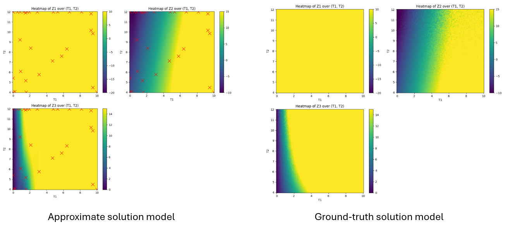
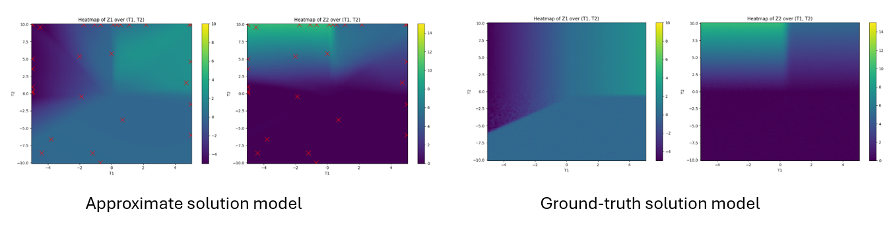
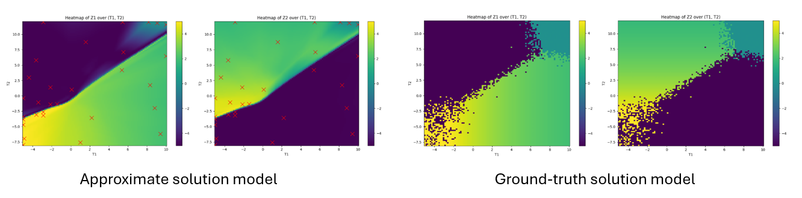
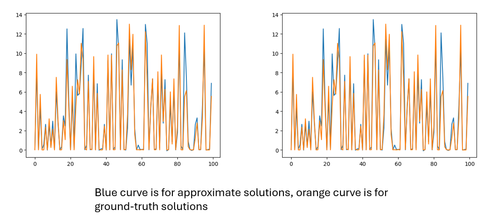

# Learning Contextual Bayesian Optimization

The repository contains source code and examples for our paper: Controller Adaptation via Learning Solution of Contextual Bayesian Optimization


## Installation ##
This code uses BOTorch and GPyTorch for training the Bayesian optimization and Gaussian Process implementation. We also use CasADi for solving nonlinear MPC problems.

The necessary Python packages can be installed by running the following script. The code has been tested with Python 3.10.12.

```
pip install -r requirements.txt
```

## Examples ##
This repo contains four synthetic examples that can be found in the [examples](https://github.com/vietanhle0101/Learn-Contextual-BayesOpt/tree/main/examples) folder.

Example 1: The mapping from contexts to solutions is smooth.



Example 2: The mapping from contexts to solutions is non-smooth.



Example 3: The mapping from contexts to solutions is discontinuous and noisy.



Example 4: The dimension of context variables is higher.




## Learning MPC Weight Adaptation Example ##
We include the example of learning MPC weight adaptation strategy that was presented in the paper. The training script and its help menu: 

```
python3 train.py --help
```

